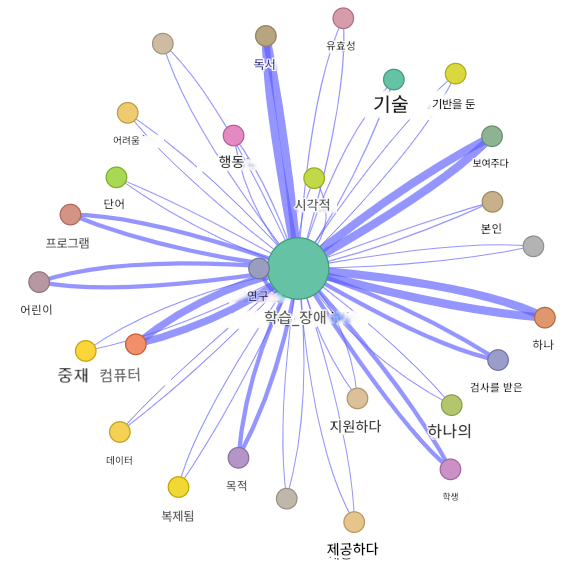
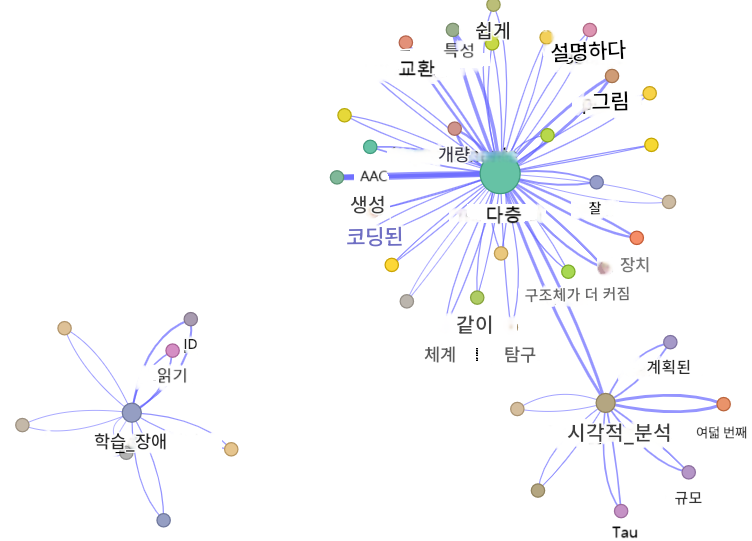
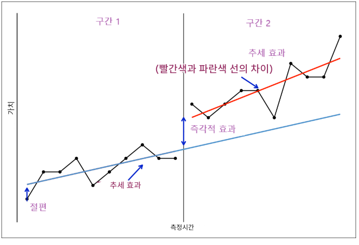
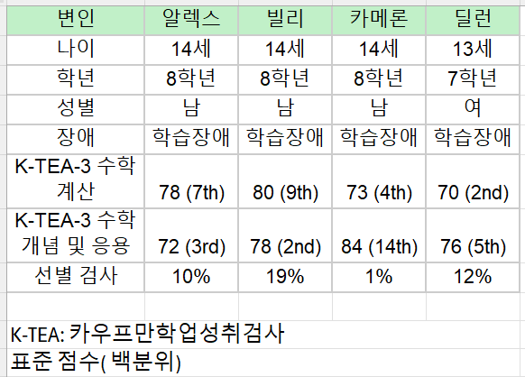
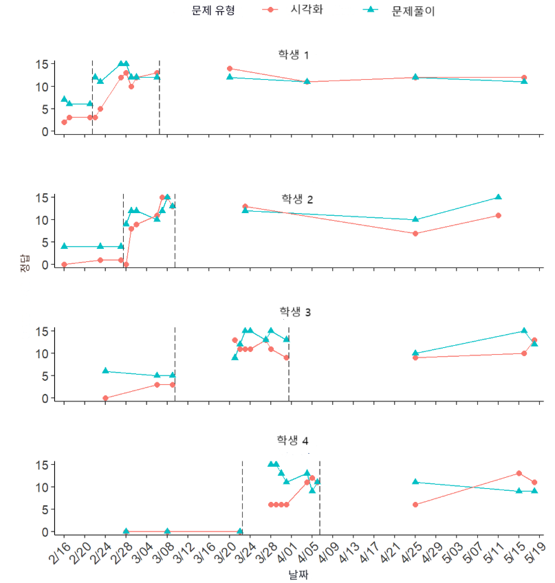

---
author:
  - name: Mikyung Shin (신미경)
    affiliation: Illinois State University
    email: mshin2@ilstu.edu
    orcid: https://orcid.org/0000-0001-7907-9193
format: 
  revealjs:
    theme: ["theme/ppt-theme.scss"]
    transition: slide
    transition-speed: fast
    slide-number: c/t
    logo: ""
    code-copy: true
    center-title-slide: false
    chalkboard: 
      buttons: true
    code-fold: true
    code-overflow: scroll
    code-link: true
    highlight-style: a11y
    touch: true
    controls: true
    hash-type: number
    hash-one-based-index: true
    slide-tone: false
linestretch: 1.5
width: 1024 
height: 768
execute: 
  eval: true
  echo: true
editor: 
  markdown: 
    wrap: 72
---


<br><br>

<h1>시각적 분석 및 베이지안 다층 모형: 학습장애 학생을 위한 단일대상설계
연구</h1>

<h4>신미경 (Illinois State University 조교수) 박지연 (Eastern Kentucky
University 부교수)</h4>

<br>

<h1>Visual Analysis and Bayesian Multilevel Models: Single-Case Design
Research for Students with Learning Disabilities</h1>

<h4>Mikyung Shin (Assistant Professor, Dept. of Special Education)
Jiyeon Park (Associate Professor, Dept. of Teaching, Learning, and
Educational Leadership)</h4>

<h4>`<svg aria-hidden="true" role="img" viewBox="0 0 496 512" style="height:1em;width:0.97em;vertical-align:-0.125em;margin-left:auto;margin-right:auto;font-size:inherit;fill:#233150;overflow:visible;position:relative;"><path d="M165.9 397.4c0 2-2.3 3.6-5.2 3.6-3.3.3-5.6-1.3-5.6-3.6 0-2 2.3-3.6 5.2-3.6 3-.3 5.6 1.3 5.6 3.6zm-31.1-4.5c-.7 2 1.3 4.3 4.3 4.9 2.6 1 5.6 0 6.2-2s-1.3-4.3-4.3-5.2c-2.6-.7-5.5.3-6.2 2.3zm44.2-1.7c-2.9.7-4.9 2.6-4.6 4.9.3 2 2.9 3.3 5.9 2.6 2.9-.7 4.9-2.6 4.6-4.6-.3-1.9-3-3.2-5.9-2.9zM244.8 8C106.1 8 0 113.3 0 252c0 110.9 69.8 205.8 169.5 239.2 12.8 2.3 17.3-5.6 17.3-12.1 0-6.2-.3-40.4-.3-61.4 0 0-70 15-84.7-29.8 0 0-11.4-29.1-27.8-36.6 0 0-22.9-15.7 1.6-15.4 0 0 24.9 2 38.6 25.8 21.9 38.6 58.6 27.5 72.9 20.9 2.3-16 8.8-27.1 16-33.7-55.9-6.2-112.3-14.3-112.3-110.5 0-27.5 7.6-41.3 23.6-58.9-2.6-6.5-11.1-33.3 2.6-67.9 20.9-6.5 69 27 69 27 20-5.6 41.5-8.5 62.8-8.5s42.8 2.9 62.8 8.5c0 0 48.1-33.6 69-27 13.7 34.7 5.2 61.4 2.6 67.9 16 17.7 25.8 31.5 25.8 58.9 0 96.5-58.9 104.2-114.8 110.5 9.2 7.9 17 22.9 17 46.4 0 33.7-.3 75.4-.3 83.6 0 6.5 4.6 14.4 17.3 12.1C428.2 457.8 496 362.9 496 252 496 113.3 383.5 8 244.8 8zM97.2 352.9c-1.3 1-1 3.3.7 5.2 1.6 1.6 3.9 2.3 5.2 1 1.3-1 1-3.3-.7-5.2-1.6-1.6-3.9-2.3-5.2-1zm-10.8-8.1c-.7 1.3.3 2.9 2.3 3.9 1.6 1 3.6.7 4.3-.7.7-1.3-.3-2.9-2.3-3.9-2-.6-3.6-.3-4.3.7zm32.4 35.6c-1.6 1.3-1 4.3 1.3 6.2 2.3 2.3 5.2 2.6 6.5 1 1.3-1.3.7-4.3-1.3-6.2-2.2-2.3-5.2-2.6-6.5-1zm-11.4-14.7c-1.6 1-1.6 3.6 0 5.9 1.6 2.3 4.3 3.3 5.6 2.3 1.6-1.3 1.6-3.9 0-6.2-1.4-2.3-4-3.3-5.6-2z"/></svg>`{=html}  
[github.com/mshin77/2025ksse](https://github.com/mshin77/2025ksse)  
`<svg aria-hidden="true" role="img" viewBox="0 0 576 512" style="height:1em;width:1.12em;vertical-align:-0.125em;margin-left:auto;margin-right:auto;font-size:inherit;fill:#233150;overflow:visible;position:relative;"><path d="M575.8 255.5c0 18-15 32.1-32 32.1h-32l.7 160.2c0 2.7-.2 5.4-.5 8.1V472c0 22.1-17.9 40-40 40H456c-1.1 0-2.2 0-3.3-.1c-1.4 .1-2.8 .1-4.2 .1H416 392c-22.1 0-40-17.9-40-40V448 384c0-17.7-14.3-32-32-32H256c-17.7 0-32 14.3-32 32v64 24c0 22.1-17.9 40-40 40H160 128.1c-1.5 0-3-.1-4.5-.2c-1.2 .1-2.4 .2-3.6 .2H104c-22.1 0-40-17.9-40-40V360c0-.9 0-1.9 .1-2.8V287.6H32c-18 0-32-14-32-32.1c0-9 3-17 10-24L266.4 8c7-7 15-8 22-8s15 2 21 7L564.8 231.5c8 7 12 15 11 24z"/></svg>`{=html}  
[mshin77.net](https://mshin77.net)</h4>

::: footer
2025 한국특수교육학회 하계학술대회 발표 2025.6.28.
:::

## `목차`


::: {.cell}

```{.r .cell-code}
# Set up

load("data/2025ksse_data.RData")

suppressPackageStartupMessages({
    library(readxl)
    library(readr)
    library(kableExtra)
    library(plotly)
    library(ggplot2)
    library(dplyr)
    library(tidyr)
    library(nlme)
    library(scdhlm)
    library(sjPlot)
    library(quanteda)
    library(TextAnalysisR)
    library(spacyr)
    library(stringr)
    library(widyr)
    library(tidygraph)
    library(visNetwork)
    library(RColorBrewer)
    library(htmltools)
})

htmltools::tags$style(HTML("
  div.dataTables_info, 
  div.dataTables_paginate, 
  .dataTables_length, 
  .dataTables_filter {
    font-size: 20px !important;
  }
  .dataTables_paginate ul.pagination {
    flex-wrap: nowrap !important;
    white-space: nowrap !important;
  }
"))
```

::: {.cell-output-display}

```{=html}
<style>
  div.dataTables_info, 
  div.dataTables_paginate, 
  .dataTables_length, 
  .dataTables_filter {
    font-size: 20px !important;
  }
  .dataTables_paginate ul.pagination {
    flex-wrap: nowrap !important;
    white-space: nowrap !important;
  }
</style>
```

:::
:::


::::: columns
::: {.column width="70%"}
-   학습장애 학생 대상 단일대상 실험설계 동향 <br>
-   시각적 분석 특성 <br>
-   다층 종단 모형 분석 특성 <br>
-   학습장애 학생 수학 중재 연구
- 시각적 분석 연구 결과
- 베이지안 다층 모형 연구결과
:::

::: {.column width="30%"}
{fig-align="center" width="209"}
:::
:::::

## `단일대상 실험설계 동향`


::: {.cell}

```{.r .cell-code}
df <- read_excel("data/wos.xlsx")

year_doc <- df %>%
  dplyr::select(PY, UT) %>%
  group_by(PY) %>%
  dplyr::summarize(publication_number = n()) 

year_plot <- year_doc %>%
  ggplot() +
  geom_col(aes(PY, publication_number), fill = "#B3B3B3") +
  labs(x = "", y = "논문 수") +
  theme_classic(base_size = 14) +
  theme(
    axis.line           = element_line(color = "#404040", linewidth =  0.2),
    axis.title.y.left   = element_text(size = 16, color = "#404040", margin = margin(r = 10)),
    axis.text.y.left    = element_text(size = 16, margin = margin(l = 7)),
    axis.text.x         = element_text(size = 14)
  ) +
  annotate("text", 
           x = min(year_doc$PY) + (max(year_doc$PY) - min(year_doc$PY))/2.5,
           y = max(year_doc$publication_number) * 0.9,
           label = "데이터베이스: Web of Science, 1970-2025\n총 3,508편 (단일대상: \"single* case* design\" 등 18개 검색어)\nAND (공학: \"technolog*\" 등 49개 검색어)",
           hjust = 0,
           size = 6,
           color = "#404040") +
  annotate("text",
           x = max(year_doc$PY) - 7,
           y = -12,
           label = "(Shin & McKenna, 2025) 자료",
           hjust = 1,
           vjust = 0,
           size = 4,
           color = "#404040")

year_plotly <- year_plot %>% plotly::ggplotly() 
```
:::

::: {.cell}
::: {.cell-output-display}

```{=html}
<div class="plotly html-widget html-fill-item" id="htmlwidget-dedb88a8fbbf099df2f3" style="width:960px;height:480px;"></div>
<script type="application/json" data-for="htmlwidget-dedb88a8fbbf099df2f3">{"x":{"data":[{"orientation":"v","width":[0.90000000000009095,0.90000000000009095,0.90000000000009095,0.90000000000009095,0.90000000000009095,0.90000000000009095,0.90000000000009095,0.90000000000009095,0.90000000000009095,0.90000000000009095,0.90000000000009095,0.90000000000009095,0.90000000000009095,0.90000000000009095,0.90000000000009095,0.90000000000009095,0.90000000000009095,0.90000000000009095,0.90000000000009095,0.90000000000009095,0.90000000000009095,0.90000000000009095,0.90000000000009095,0.90000000000009095,0.90000000000009095,0.90000000000009095,0.90000000000009095,0.90000000000009095,0.90000000000009095,0.90000000000009095,0.90000000000009095,0.90000000000009095,0.90000000000009095,0.90000000000009095,0.90000000000009095,0.90000000000009095,0.90000000000009095,0.90000000000009095,0.90000000000009095,0.90000000000009095,0.90000000000009095,0.90000000000009095,0.90000000000009095,0.90000000000009095,0.90000000000009095,0.90000000000009095,0.90000000000009095,0.90000000000009095,0.90000000000009095,0.90000000000009095,0.90000000000009095,0.90000000000009095,0.90000000000009095,0.90000000000009095,0.90000000000009095],"base":[0,0,0,0,0,0,0,0,0,0,0,0,0,0,0,0,0,0,0,0,0,0,0,0,0,0,0,0,0,0,0,0,0,0,0,0,0,0,0,0,0,0,0,0,0,0,0,0,0,0,0,0,0,0,0],"x":[1971,1972,1973,1974,1975,1976,1977,1978,1979,1980,1981,1982,1983,1984,1985,1986,1987,1988,1989,1990,1991,1992,1993,1994,1995,1996,1997,1998,1999,2000,2001,2002,2003,2004,2005,2006,2007,2008,2009,2010,2011,2012,2013,2014,2015,2016,2017,2018,2019,2020,2021,2022,2023,2024,2025],"y":[1,3,1,2,1,3,8,4,9,14,4,2,5,4,6,5,8,3,5,3,15,27,23,21,19,17,21,40,27,36,27,39,35,33,36,35,44,40,66,70,84,94,116,126,148,135,138,168,177,238,229,278,296,365,154],"text":["PY: 1971<br />publication_number:   1","PY: 1972<br />publication_number:   3","PY: 1973<br />publication_number:   1","PY: 1974<br />publication_number:   2","PY: 1975<br />publication_number:   1","PY: 1976<br />publication_number:   3","PY: 1977<br />publication_number:   8","PY: 1978<br />publication_number:   4","PY: 1979<br />publication_number:   9","PY: 1980<br />publication_number:  14","PY: 1981<br />publication_number:   4","PY: 1982<br />publication_number:   2","PY: 1983<br />publication_number:   5","PY: 1984<br />publication_number:   4","PY: 1985<br />publication_number:   6","PY: 1986<br />publication_number:   5","PY: 1987<br />publication_number:   8","PY: 1988<br />publication_number:   3","PY: 1989<br />publication_number:   5","PY: 1990<br />publication_number:   3","PY: 1991<br />publication_number:  15","PY: 1992<br />publication_number:  27","PY: 1993<br />publication_number:  23","PY: 1994<br />publication_number:  21","PY: 1995<br />publication_number:  19","PY: 1996<br />publication_number:  17","PY: 1997<br />publication_number:  21","PY: 1998<br />publication_number:  40","PY: 1999<br />publication_number:  27","PY: 2000<br />publication_number:  36","PY: 2001<br />publication_number:  27","PY: 2002<br />publication_number:  39","PY: 2003<br />publication_number:  35","PY: 2004<br />publication_number:  33","PY: 2005<br />publication_number:  36","PY: 2006<br />publication_number:  35","PY: 2007<br />publication_number:  44","PY: 2008<br />publication_number:  40","PY: 2009<br />publication_number:  66","PY: 2010<br />publication_number:  70","PY: 2011<br />publication_number:  84","PY: 2012<br />publication_number:  94","PY: 2013<br />publication_number: 116","PY: 2014<br />publication_number: 126","PY: 2015<br />publication_number: 148","PY: 2016<br />publication_number: 135","PY: 2017<br />publication_number: 138","PY: 2018<br />publication_number: 168","PY: 2019<br />publication_number: 177","PY: 2020<br />publication_number: 238","PY: 2021<br />publication_number: 229","PY: 2022<br />publication_number: 278","PY: 2023<br />publication_number: 296","PY: 2024<br />publication_number: 365","PY: 2025<br />publication_number: 154"],"type":"bar","textposition":"none","marker":{"autocolorscale":false,"color":"rgba(179,179,179,1)","line":{"width":1.8897637795275593,"color":"transparent"}},"showlegend":false,"xaxis":"x","yaxis":"y","hoverinfo":"text","frame":null},{"x":[1992.5999999999999],"y":[328.5],"text":"데이터베이스: Web of Science, 1970-2025<br />총 3,508편 (단일대상: \"single* case* design\" 등 18개 검색어)<br />AND (공학: \"technolog*\" 등 49개 검색어)","hovertext":"x: 1992.6<br />y: 328.5","textfont":{"size":22.677165354330711,"color":"rgba(64,64,64,1)"},"type":"scatter","mode":"text","hoveron":"points","showlegend":false,"xaxis":"x","yaxis":"y","hoverinfo":"text","frame":null},{"x":[2018],"y":[-12],"text":"(Shin & McKenna, 2025) 자료","hovertext":"x: 2018<br />y: -12","textfont":{"size":15.118110236220474,"color":"rgba(64,64,64,1)"},"type":"scatter","mode":"text","hoveron":"points","showlegend":false,"xaxis":"x","yaxis":"y","hoverinfo":"text","frame":null}],"layout":{"margin":{"t":34.596928185969276,"r":9.2984640929846396,"b":41.843088418430881,"l":54.860938148609378},"plot_bgcolor":"rgba(255,255,255,1)","paper_bgcolor":"rgba(255,255,255,1)","font":{"color":"rgba(0,0,0,1)","family":"","size":18.596928185969279},"xaxis":{"domain":[0,1],"automargin":true,"type":"linear","autorange":false,"range":[1967.8049999999998,2028.1950000000002],"tickmode":"array","ticktext":["1970","1980","1990","2000","2010","2020"],"tickvals":[1970,1980,1990,2000,2010,2020],"categoryorder":"array","categoryarray":["1970","1980","1990","2000","2010","2020"],"nticks":null,"ticks":"outside","tickcolor":"rgba(51,51,51,1)","ticklen":4.6492320464923198,"tickwidth":0.8453149175440583,"showticklabels":true,"tickfont":{"color":"rgba(77,77,77,1)","family":"","size":18.596928185969279},"tickangle":-0,"showline":true,"linecolor":"rgba(64,64,64,1)","linewidth":0.265670402656704,"showgrid":false,"gridcolor":null,"gridwidth":0,"zeroline":false,"anchor":"y","title":{"text":"","font":{"color":"rgba(0,0,0,1)","family":"","size":18.596928185969279}},"hoverformat":".2f"},"yaxis":{"domain":[0,1],"automargin":true,"type":"linear","autorange":false,"range":[-30.850000000000001,383.85000000000002],"tickmode":"array","ticktext":["0","100","200","300"],"tickvals":[-3.5527136788005009e-15,100,200,300],"categoryorder":"array","categoryarray":["0","100","200","300"],"nticks":null,"ticks":"outside","tickcolor":"rgba(51,51,51,1)","ticklen":4.6492320464923198,"tickwidth":0.8453149175440583,"showticklabels":true,"tickfont":{"color":"rgba(77,77,77,1)","family":"","size":14.877542548775427},"tickangle":-0,"showline":true,"linecolor":"rgba(64,64,64,1)","linewidth":0.265670402656704,"showgrid":false,"gridcolor":null,"gridwidth":0,"zeroline":false,"anchor":"x","title":{"text":"논문 수","font":{"color":"rgba(0,0,0,1)","family":"","size":18.596928185969279}},"hoverformat":".2f"},"shapes":[{"type":"rect","fillcolor":null,"line":{"color":null,"width":0,"linetype":[]},"yref":"paper","xref":"paper","x0":0,"x1":1,"y0":0,"y1":1}],"showlegend":false,"legend":{"bgcolor":"rgba(255,255,255,1)","bordercolor":"transparent","borderwidth":2.405153901216893,"font":{"color":"rgba(0,0,0,1)","family":"","size":14.877542548775427}},"hovermode":"closest","barmode":"relative"},"config":{"doubleClick":"reset","modeBarButtonsToAdd":["hoverclosest","hovercompare"],"showSendToCloud":false},"source":"A","attrs":{"652c1feb3c29":{"x":{},"y":{},"type":"bar"},"652c316b7361":{"x":{},"y":{}},"652c93d31a0":{"x":{},"y":{}}},"cur_data":"652c1feb3c29","visdat":{"652c1feb3c29":["function (y) ","x"],"652c316b7361":["function (y) ","x"],"652c93d31a0":["function (y) ","x"]},"highlight":{"on":"plotly_click","persistent":false,"dynamic":false,"selectize":false,"opacityDim":0.20000000000000001,"selected":{"opacity":1},"debounce":0},"shinyEvents":["plotly_hover","plotly_click","plotly_selected","plotly_relayout","plotly_brushed","plotly_brushing","plotly_clickannotation","plotly_doubleclick","plotly_deselect","plotly_afterplot","plotly_sunburstclick"],"base_url":"https://plot.ly"},"evals":[],"jsHooks":[]}</script>
```

:::
:::


## `1971년-2009년 학습장애 학생 단일대상 실험설계 동향`

::::: columns
::: {.column width="60%"}


-   [<i class="fas fa-project-diagram"></i>](figures/network_2009_earlier.html){.hover-effect
    style="color: #6D6D6D; text-decoration: none;"} 3번이상 언급, 최소
    0.2 상관관계

-   "학습장애" 가장 높은 연결중심성

-   "학습장애"와 "읽기" 0.56의 가장 높은 상관관계

{fig-align="center" width="507"
height="420"}
:::

::: {.column width="40%"}


::: {.cell}
::: {.cell-output-display}

```{=html}
<div class="datatables html-widget html-fill-item" id="htmlwidget-4ff550a253bc0eb264e4" style="width:100%;height:auto;"></div>
<script type="application/json" data-for="htmlwidget-4ff550a253bc0eb264e4">{"x":{"filter":"none","vertical":false,"extensions":["Buttons"],"data":[["learning_disabilities","show","reading","one","computer","program","child","studies","examined","purpose","student","behavior","effectiveness","technology","self","single","words","visual","based","replicated","intervention","data","difficulties","provide","support","special","education","indicated"],[54,2,2,2,2,2,2,2,2,2,2,2,2,2,2,2,2,2,2,2,2,2,2,2,2,2,2,2],[1,0.192,0.192,0.192,0.192,0.192,0.192,0.192,0.192,0.192,0.192,0.192,0.192,0.192,0.192,0.192,0.192,0.192,0.192,0.192,0.192,0.192,0.192,0.192,0.192,0.192,0.192,0.192]],"container":"<table class=\"display\">\n  <thead>\n    <tr>\n      <th>단어<\/th>\n      <th>연결<\/th>\n      <th>고유벡터<\/th>\n    <\/tr>\n  <\/thead>\n<\/table>","options":{"scrollX":true,"width":"80%","dom":"Bfrtip","pageLength":10,"buttons":[""],"pagingType":"full","headerCallback":"function(thead, data, start, end, display){\n  $(thead).find('th').css({\n    'font-size': '20px', \n    'padding': '4px 8px'\n  });\n}","columnDefs":[{"className":"dt-right","targets":[1,2]},{"name":"단어","targets":0},{"name":"연결","targets":1},{"name":"고유벡터","targets":2}],"order":[],"autoWidth":false,"orderClasses":false,"rowCallback":"function(row, data, displayNum, displayIndex, dataIndex) {\nvar value=data[0]; $(this.api().cell(row, 0).node()).css({'font-size':'20px'});\nvar value=data[1]; $(this.api().cell(row, 1).node()).css({'font-size':'20px'});\nvar value=data[2]; $(this.api().cell(row, 2).node()).css({'font-size':'20px'});\n}"},"selection":{"mode":"multiple","selected":null,"target":"row","selectable":null}},"evals":["options.headerCallback","options.rowCallback"],"jsHooks":[]}</script>
```

:::
:::


:::
:::::

## `2010년-2025년 학습장애 학생 단일대상 실험설계 동향`

::::: columns
::: {.column width="60%"}


::: {.cell}

```{.r .cell-code}
df_2010_later <- df %>%
  filter(
    PY >= 2010 &
    (
      str_detect(AB, regex("learn.* disab.*", ignore_case = TRUE)) |
      str_detect(DE, regex("learn.* disab.*", ignore_case = TRUE)) |
      str_detect(TI, regex("learn.* disab.*", ignore_case = TRUE))
    )
  )

united_tbl_2010_later <- TextAnalysisR::unite_text_cols(df_2010_later, listed_vars = c("AB", "DE", "TI"))

tokens_2010_later <- TextAnalysisR::preprocess_texts(united_tbl_2010_later,
                                          text_field = "united_texts",
                                          min_char = 2,
                                          remove_punct = TRUE,
                                          remove_symbols = TRUE,
                                          remove_numbers = TRUE,
                                          remove_url = TRUE,
                                          remove_separators = TRUE,
                                          split_hyphens = TRUE,
                                          split_tags = TRUE,
                                          include_docvars = TRUE,
                                          keep_acronyms = FALSE,
                                          padding = FALSE,
                                          verbose = FALSE)

custom_dict <- quanteda::dictionary(list(custom = c("learning disabilities", "single-case", "single-subject", "functional relation", "visual analysis")))

toks_compound_2010_later <- quanteda::tokens_compound(
  tokens_2010_later,
  pattern = custom_dict,
  concatenator = "_",
  valuetype = "glob",
  window = 0,
  case_insensitive = TRUE,
  join = TRUE,
  keep_unigrams = FALSE,
  verbose = TRUE
)

dfm_object_init_2010_later <- quanteda::dfm(toks_compound_2010_later)

stopwords <- stopwords::stopwords("en", source = "snowball")

toks_removed_2010_later <- quanteda::tokens_remove(toks_compound_2010_later, pattern = stopwords, verbose = FALSE)

dfm_init_2010_later <- quanteda::dfm(toks_removed_2010_later)

common_words <- c("study", "students", "research", "results")

toks_removed_common_2010_later <- quanteda::tokens_remove(toks_removed_2010_later, pattern = common_words, verbose = FALSE)

dfm_2010_later <- quanteda::dfm(toks_removed_common_2010_later)

# TextAnalysisR::plot_word_frequency(dfm_2010_later, n = 20)

word_network_2010_later <- word_correlation_network(
  dfm_2010_later,
  doc_var = NULL,
  common_term_n = 3,
  corr_n = 0.28,
  top_node_n = 25,
  node_label = 30,
  nrows = 1,
  height = 1000,
  width = 1500,
  pattern = "learn.*disab.*|single.*case|single.*subject|visual.*analy*|multi.*level|funtion.*relation|bayesian",
  showlegend = FALSE,
  seed = 2025
)

network_2010_later_plot <- word_network_2010_later$plot  
network_2010_later_table <- word_network_2010_later$table  

htmlwidgets::saveWidget(network_2010_later_plot, file = "figures/network_2010_later.html", selfcontained = TRUE)
```
:::


-   [<i class="fas fa-project-diagram"></i>](figures/network_2010_later.html){.hover-effect
    style="color: #6D6D6D; text-decoration: none;"} 3번이상 언급, 최소
    0.28 상관관계
-   "다층" 가장 높은 연결중심성
-   "다층"과 "시각적 분석" 0.42의 높은 상관관계
-   "시각적 분석"과 "Tau" 0.34의 상관관계

{fig-align="center" width="556"
height="367"}
:::

::: {.column width="40%"}


::: {.cell}
::: {.cell-output-display}

```{=html}
<div class="datatables html-widget html-fill-item" id="htmlwidget-f00e24eb2dddade947f8" style="width:100%;height:auto;"></div>
<script type="application/json" data-for="htmlwidget-f00e24eb2dddade947f8">{"x":{"filter":"none","vertical":false,"extensions":["Buttons"],"data":[["multilevel","generating","features","visual_analysis","picture","eighth","devices","exchange","improvements","greater","ld","learning_disabilities","well","calculated","scale","aac","tau","reading","systems","describe","coded","requesting","easily","equally","structured","diverse","functions","complexity","fraction","ranged","perceived","useful","co","programming","learner","comprehension","algebra","introduction","word","spectrum","augmentative","text","outcomes","equations"],[58,2,2,14,2,2,2,2,2,2,2,14,2,2,2,2,2,2,2,2,2,2,2,2,2,2,2,2,2,2,2,2,2,2,2,2,2,2,2,2,2,2,2,2],[1,0.185,0.185,0.233,0.185,0.043,0.185,0.185,0.185,0.185,0,0,0.185,0.043,0.043,0.185,0.043,0,0.185,0.185,0.185,0.185,0.185,0.185,0.185,0.185,0.185,0.185,0.185,0.185,0.185,0.185,0.185,0.185,0.185,0,0,0.043,0,0.043,0.185,0,0.185,0]],"container":"<table class=\"display\">\n  <thead>\n    <tr>\n      <th>단어<\/th>\n      <th>연결<\/th>\n      <th>고유벡터<\/th>\n    <\/tr>\n  <\/thead>\n<\/table>","options":{"scrollX":true,"width":"80%","dom":"Bfrtip","pageLength":10,"buttons":[""],"pagingType":"full","headerCallback":"function(thead, data, start, end, display){\n  $(thead).find('th').css({\n    'font-size': '20px', \n    'padding': '4px 8px'\n  });\n}","columnDefs":[{"className":"dt-right","targets":[1,2]},{"name":"단어","targets":0},{"name":"연결","targets":1},{"name":"고유벡터","targets":2}],"order":[],"autoWidth":false,"orderClasses":false,"rowCallback":"function(row, data, displayNum, displayIndex, dataIndex) {\nvar value=data[0]; $(this.api().cell(row, 0).node()).css({'font-size':'20px'});\nvar value=data[1]; $(this.api().cell(row, 1).node()).css({'font-size':'20px'});\nvar value=data[2]; $(this.api().cell(row, 2).node()).css({'font-size':'20px'});\n}"},"selection":{"mode":"multiple","selected":null,"target":"row","selectable":null}},"evals":["options.headerCallback","options.rowCallback"],"jsHooks":[]}</script>
```

:::
:::


:::
:::::

## `시각적 분석을 통한 행동 변화 확인`

-   개별 학생(*N*=1) 또는 소집단을 대상으로 중재를 제공

-   행동의 예측, 검증, 재현 과정을 통하여 내적 타당도를 확인

-   그래프 데이터가 수집되어야 하며, 시각적인 분석이 이루어짐

-   연구설계에 따라서 기초선, 중재, 유지, 일반화 구간 등 설정


::: {.cell}

```{.r .cell-code}
AB <- read_csv("data/ABAB.csv", show_col_types = FALSE)

AB$Case <- paste0("학생 ", AB$Case, sep = "")

AB.plot <-  AB %>%
    ggplot(aes(Session, Outcome)) +
    geom_line(data = subset(AB, AB$Phase == "Baseline1"), aes(linetype='1'), linewidth = 0.5) +
    geom_line(data = subset(AB, AB$Phase == "Baseline1.Predict"), aes(linetype='2'), linewidth = 0.5) +
    geom_line(data = subset(AB, AB$Phase == "Intervention1"), aes(linetype='1'), linewidth = 0.5) +
    geom_line(data = subset(AB, AB$Phase == "Intervention1.Predict"), aes(linetype='2'), linewidth = 0.5) +
    geom_line(data = subset(AB, AB$Phase == "Baseline2"), aes(linetype='1'), linewidth = 0.5) +
    geom_line(data = subset(AB, AB$Phase == "Intervention2"), aes(linetype='1'), linewidth = 0.5) +
    geom_point(size = 2.5) +
    theme_minimal(base_size = 13) +
    theme(
        plot.title = element_text(face = "bold", size = 15),
        legend.position ="top",
        panel.grid.major = element_line(colour = "grey95", linewidth = 0.2),
        panel.grid.minor = element_blank(),
        legend.text = element_text(size = 13),
        legend.title = element_text(size = 13, hjust = 0.5),
        strip.text.x = element_text(color = "#3B3B3B", size = 13),
        axis.text.x = element_text(size = 13, color = "#3B3B3B"),
        axis.text.y = element_text(size = 13, color = "#3B3B3B"),
        axis.title = element_text(face = "bold", size = 13, color = "#3B3B3B")
    ) +
    labs(
        x = "회기",
        y = "바람직한 행동(%)"
    ) +
    guides(linetype="none") +
    geom_vline(aes(xintercept = 3.5), linetype = "longdash", linewidth = 0.3, color = "grey10") +
    geom_vline(aes(xintercept = 8.5), linetype = "longdash", linewidth = 0.3, color = "grey10") +
    geom_vline(aes(xintercept = 12.5), linetype = "longdash", linewidth = 0.3, color = "grey10") +
    annotate(geom = "text", x = 2, y = 95, label = "기초선", color = "#0000FF", fontface = 'bold', size = 5.5) +
    annotate(geom = "text", x = 6, y = 95, label = "중재", color = "#0000FF", fontface = 'bold', size = 5.5) +
    annotate(geom = "text", x = 10.5, y = 95, label = "기초선", color = "#0000FF", fontface = 'bold', size = 5.5) +
    annotate(geom = "text", x = 15, y = 95, label = "중재", color = "#0000FF", fontface = 'bold', size = 5.5) +
    annotate(geom = "text", x = 6, y = 25, label = "예측하기", color = 'red', fontface = 'bold', size = 5.5) +
    annotate(geom = "text", x = 10.5, y = 5, label = "검증하기", color = 'red', fontface = 'bold', size = 5.5) +
    annotate(geom = "text", x = 15, y = 75, label = "재현하기", color = 'red', fontface = 'bold', size = 5.5) +
    annotate("rect", xmin = 3.8, xmax = 8.3, ymin = 0, ymax = 20, alpha = .2) +
    annotate("rect", xmin = 8.8, xmax = 12.3, ymin = 60, ymax = 90, alpha = .2) 

AB_plot <- AB.plot %>% ggplotly(height = 400) %>% layout(dragmode = "select")
```
:::

::: {.cell}
::: {.cell-output-display}

```{=html}
<div id="htmlwidget-c37b709a067bc4477a8f" style="width:960px;height:400px;" class="plotly html-widget"></div>
<script type="application/json" data-for="htmlwidget-c37b709a067bc4477a8f">{"x":{"data":[{"x":[1,2,3],"y":[20,20,0],"text":["Session: 1<br />Outcome: 20<br />linetype: 1","Session: 2<br />Outcome: 20<br />linetype: 1","Session: 3<br />Outcome:  0<br />linetype: 1"],"type":"scatter","mode":"lines","line":{"width":1.8897637795275593,"color":"rgba(0,0,0,1)","dash":"solid"},"hoveron":"points","showlegend":false,"xaxis":"x","yaxis":"y","hoverinfo":"text","frame":null},{"x":[4,5,6,7,8],"y":[10,5,5,4,4],"text":["Session: 4<br />Outcome: 10<br />linetype: 2","Session: 5<br />Outcome:  5<br />linetype: 2","Session: 6<br />Outcome:  5<br />linetype: 2","Session: 7<br />Outcome:  4<br />linetype: 2","Session: 8<br />Outcome:  4<br />linetype: 2"],"type":"scatter","mode":"lines","line":{"width":1.8897637795275593,"color":"rgba(0,0,0,1)","dash":"dash"},"hoveron":"points","showlegend":false,"xaxis":"x","yaxis":"y","hoverinfo":"text","frame":null},{"x":[4,5,6,7,8],"y":[40,60,40,60,65],"text":["Session: 4<br />Outcome: 40<br />linetype: 1","Session: 5<br />Outcome: 60<br />linetype: 1","Session: 6<br />Outcome: 40<br />linetype: 1","Session: 7<br />Outcome: 60<br />linetype: 1","Session: 8<br />Outcome: 65<br />linetype: 1"],"type":"scatter","mode":"lines","line":{"width":1.8897637795275593,"color":"rgba(0,0,0,1)","dash":"solid"},"hoveron":"points","showlegend":false,"xaxis":"x","yaxis":"y","hoverinfo":"text","frame":null},{"x":[9,10,11,12],"y":[70,65,70,75],"text":["Session:  9<br />Outcome: 70<br />linetype: 2","Session: 10<br />Outcome: 65<br />linetype: 2","Session: 11<br />Outcome: 70<br />linetype: 2","Session: 12<br />Outcome: 75<br />linetype: 2"],"type":"scatter","mode":"lines","line":{"width":1.8897637795275593,"color":"rgba(0,0,0,1)","dash":"dash"},"hoveron":"points","showlegend":false,"xaxis":"x","yaxis":"y","hoverinfo":"text","frame":null},{"x":[9,10,11,12],"y":[20,30,20,18],"text":["Session:  9<br />Outcome: 20<br />linetype: 1","Session: 10<br />Outcome: 30<br />linetype: 1","Session: 11<br />Outcome: 20<br />linetype: 1","Session: 12<br />Outcome: 18<br />linetype: 1"],"type":"scatter","mode":"lines","line":{"width":1.8897637795275593,"color":"rgba(0,0,0,1)","dash":"solid"},"hoveron":"points","showlegend":false,"xaxis":"x","yaxis":"y","hoverinfo":"text","frame":null},{"x":[13,14,15,16,17],"y":[80,90,85,85,90],"text":["Session: 13<br />Outcome: 80<br />linetype: 1","Session: 14<br />Outcome: 90<br />linetype: 1","Session: 15<br />Outcome: 85<br />linetype: 1","Session: 16<br />Outcome: 85<br />linetype: 1","Session: 17<br />Outcome: 90<br />linetype: 1"],"type":"scatter","mode":"lines","line":{"width":1.8897637795275593,"color":"rgba(0,0,0,1)","dash":"solid"},"hoveron":"points","showlegend":false,"xaxis":"x","yaxis":"y","hoverinfo":"text","frame":null},{"x":[1,2,3,4,5,6,7,8,4,5,6,7,8,9,10,11,12,9,10,11,12,13,14,15,16,17],"y":[20,20,0,10,5,5,4,4,40,60,40,60,65,70,65,70,75,20,30,20,18,80,90,85,85,90],"text":["Session:  1<br />Outcome: 20","Session:  2<br />Outcome: 20","Session:  3<br />Outcome:  0","Session:  4<br />Outcome: 10","Session:  5<br />Outcome:  5","Session:  6<br />Outcome:  5","Session:  7<br />Outcome:  4","Session:  8<br />Outcome:  4","Session:  4<br />Outcome: 40","Session:  5<br />Outcome: 60","Session:  6<br />Outcome: 40","Session:  7<br />Outcome: 60","Session:  8<br />Outcome: 65","Session:  9<br />Outcome: 70","Session: 10<br />Outcome: 65","Session: 11<br />Outcome: 70","Session: 12<br />Outcome: 75","Session:  9<br />Outcome: 20","Session: 10<br />Outcome: 30","Session: 11<br />Outcome: 20","Session: 12<br />Outcome: 18","Session: 13<br />Outcome: 80","Session: 14<br />Outcome: 90","Session: 15<br />Outcome: 85","Session: 16<br />Outcome: 85","Session: 17<br />Outcome: 90"],"type":"scatter","mode":"markers","marker":{"autocolorscale":false,"color":"rgba(0,0,0,1)","opacity":1,"size":9.4488188976377963,"symbol":"circle","line":{"width":1.8897637795275593,"color":"rgba(0,0,0,1)"}},"hoveron":"points","showlegend":false,"xaxis":"x","yaxis":"y","hoverinfo":"text","frame":null},{"x":[3.5,3.5,3.5,3.5,3.5,3.5,3.5,3.5,3.5,3.5,3.5,3.5,3.5,3.5,3.5,3.5,3.5,3.5,3.5,3.5,3.5,3.5,3.5,3.5,3.5,3.5,3.5,3.5,3.5,3.5,3.5,3.5,3.5,3.5,3.5,3.5,3.5,3.5,3.5,3.5,3.5,3.5,3.5,3.5,3.5,3.5,3.5,3.5,3.5,3.5,3.5,3.5],"y":[-4.75,-4.75,-4.75,-4.75,-4.75,-4.75,-4.75,-4.75,-4.75,-4.75,-4.75,-4.75,-4.75,-4.75,-4.75,-4.75,-4.75,-4.75,-4.75,-4.75,-4.75,-4.75,-4.75,-4.75,-4.75,-4.75,99.75,99.75,99.75,99.75,99.75,99.75,99.75,99.75,99.75,99.75,99.75,99.75,99.75,99.75,99.75,99.75,99.75,99.75,99.75,99.75,99.75,99.75,99.75,99.75,99.75,99.75],"text":"xintercept: 3.5","type":"scatter","mode":"lines","line":{"width":1.1338582677165354,"color":"rgba(26,26,26,1)","dash":"longdash"},"hoveron":"points","showlegend":false,"xaxis":"x","yaxis":"y","hoverinfo":"text","frame":null},{"x":[8.5,8.5,8.5,8.5,8.5,8.5,8.5,8.5,8.5,8.5,8.5,8.5,8.5,8.5,8.5,8.5,8.5,8.5,8.5,8.5,8.5,8.5,8.5,8.5,8.5,8.5,8.5,8.5,8.5,8.5,8.5,8.5,8.5,8.5,8.5,8.5,8.5,8.5,8.5,8.5,8.5,8.5,8.5,8.5,8.5,8.5,8.5,8.5,8.5,8.5,8.5,8.5],"y":[-4.75,-4.75,-4.75,-4.75,-4.75,-4.75,-4.75,-4.75,-4.75,-4.75,-4.75,-4.75,-4.75,-4.75,-4.75,-4.75,-4.75,-4.75,-4.75,-4.75,-4.75,-4.75,-4.75,-4.75,-4.75,-4.75,99.75,99.75,99.75,99.75,99.75,99.75,99.75,99.75,99.75,99.75,99.75,99.75,99.75,99.75,99.75,99.75,99.75,99.75,99.75,99.75,99.75,99.75,99.75,99.75,99.75,99.75],"text":"xintercept: 8.5","type":"scatter","mode":"lines","line":{"width":1.1338582677165354,"color":"rgba(26,26,26,1)","dash":"longdash"},"hoveron":"points","showlegend":false,"xaxis":"x","yaxis":"y","hoverinfo":"text","frame":null},{"x":[12.5,12.5,12.5,12.5,12.5,12.5,12.5,12.5,12.5,12.5,12.5,12.5,12.5,12.5,12.5,12.5,12.5,12.5,12.5,12.5,12.5,12.5,12.5,12.5,12.5,12.5,12.5,12.5,12.5,12.5,12.5,12.5,12.5,12.5,12.5,12.5,12.5,12.5,12.5,12.5,12.5,12.5,12.5,12.5,12.5,12.5,12.5,12.5,12.5,12.5,12.5,12.5],"y":[-4.75,-4.75,-4.75,-4.75,-4.75,-4.75,-4.75,-4.75,-4.75,-4.75,-4.75,-4.75,-4.75,-4.75,-4.75,-4.75,-4.75,-4.75,-4.75,-4.75,-4.75,-4.75,-4.75,-4.75,-4.75,-4.75,99.75,99.75,99.75,99.75,99.75,99.75,99.75,99.75,99.75,99.75,99.75,99.75,99.75,99.75,99.75,99.75,99.75,99.75,99.75,99.75,99.75,99.75,99.75,99.75,99.75,99.75],"text":"xintercept: 12.5","type":"scatter","mode":"lines","line":{"width":1.1338582677165354,"color":"rgba(26,26,26,1)","dash":"longdash"},"hoveron":"points","showlegend":false,"xaxis":"x","yaxis":"y","hoverinfo":"text","frame":null},{"x":[2],"y":[95],"text":"기초선","hovertext":"x: 2<br />y: 95","textfont":{"size":20.787401574803152,"color":"rgba(0,0,255,1)"},"type":"scatter","mode":"text","hoveron":"points","showlegend":false,"xaxis":"x","yaxis":"y","hoverinfo":"text","frame":null},{"x":[6],"y":[95],"text":"중재","hovertext":"x: 6<br />y: 95","textfont":{"size":20.787401574803152,"color":"rgba(0,0,255,1)"},"type":"scatter","mode":"text","hoveron":"points","showlegend":false,"xaxis":"x","yaxis":"y","hoverinfo":"text","frame":null},{"x":[10.5],"y":[95],"text":"기초선","hovertext":"x: 10.5<br />y: 95","textfont":{"size":20.787401574803152,"color":"rgba(0,0,255,1)"},"type":"scatter","mode":"text","hoveron":"points","showlegend":false,"xaxis":"x","yaxis":"y","hoverinfo":"text","frame":null},{"x":[15],"y":[95],"text":"중재","hovertext":"x: 15<br />y: 95","textfont":{"size":20.787401574803152,"color":"rgba(0,0,255,1)"},"type":"scatter","mode":"text","hoveron":"points","showlegend":false,"xaxis":"x","yaxis":"y","hoverinfo":"text","frame":null},{"x":[6],"y":[25],"text":"예측하기","hovertext":"x: 6<br />y: 25","textfont":{"size":20.787401574803152,"color":"rgba(255,0,0,1)"},"type":"scatter","mode":"text","hoveron":"points","showlegend":false,"xaxis":"x","yaxis":"y","hoverinfo":"text","frame":null},{"x":[10.5],"y":[5],"text":"검증하기","hovertext":"x: 10.5<br />y: 5","textfont":{"size":20.787401574803152,"color":"rgba(255,0,0,1)"},"type":"scatter","mode":"text","hoveron":"points","showlegend":false,"xaxis":"x","yaxis":"y","hoverinfo":"text","frame":null},{"x":[15],"y":[75],"text":"재현하기","hovertext":"x: 15<br />y: 75","textfont":{"size":20.787401574803152,"color":"rgba(255,0,0,1)"},"type":"scatter","mode":"text","hoveron":"points","showlegend":false,"xaxis":"x","yaxis":"y","hoverinfo":"text","frame":null},{"x":[3.7999999999999998,3.7999999999999998,8.3000000000000007,8.3000000000000007,3.7999999999999998],"y":[0,20,20,0,0],"text":"","type":"scatter","mode":"lines","line":{"width":1.8897637795275593,"color":"transparent","dash":"solid"},"fill":"toself","fillcolor":"rgba(89,89,89,0.2)","hoveron":"fills","showlegend":false,"xaxis":"x","yaxis":"y","hoverinfo":"text","frame":null},{"x":[8.8000000000000007,8.8000000000000007,12.300000000000001,12.300000000000001,8.8000000000000007],"y":[60,90,90,60,60],"text":"","type":"scatter","mode":"lines","line":{"width":1.8897637795275593,"color":"transparent","dash":"solid"},"fill":"toself","fillcolor":"rgba(89,89,89,0.2)","hoveron":"fills","showlegend":false,"xaxis":"x","yaxis":"y","hoverinfo":"text","frame":null}],"layout":{"margin":{"t":34.412619344126199,"r":8.6342880863428846,"b":57.266915732669176,"l":47.488584474885869},"font":{"color":"rgba(0,0,0,1)","family":"","size":17.268576172685766},"xaxis":{"domain":[0,1],"automargin":true,"type":"linear","autorange":false,"range":[0.19999999999999996,17.800000000000001],"tickmode":"array","ticktext":["5","10","15"],"tickvals":[5,10,14.999999999999998],"categoryorder":"array","categoryarray":["5","10","15"],"nticks":null,"ticks":"","tickcolor":null,"ticklen":4.3171440431714414,"tickwidth":0,"showticklabels":true,"tickfont":{"color":"rgba(59,59,59,1)","family":"","size":17.268576172685766},"tickangle":-0,"showline":false,"linecolor":null,"linewidth":0,"showgrid":true,"gridcolor":"rgba(242,242,242,1)","gridwidth":0.26567040265670411,"zeroline":false,"anchor":"y","title":{"text":"<b> 회기 <\/b>","font":{"color":"rgba(59,59,59,1)","family":"","size":17.268576172685766}},"hoverformat":".2f"},"yaxis":{"domain":[0,1],"automargin":true,"type":"linear","autorange":false,"range":[-4.75,99.75],"tickmode":"array","ticktext":["0","25","50","75"],"tickvals":[0,25,50,75],"categoryorder":"array","categoryarray":["0","25","50","75"],"nticks":null,"ticks":"","tickcolor":null,"ticklen":4.3171440431714423,"tickwidth":0,"showticklabels":true,"tickfont":{"color":"rgba(59,59,59,1)","family":"","size":17.268576172685769},"tickangle":-0,"showline":false,"linecolor":null,"linewidth":0,"showgrid":true,"gridcolor":"rgba(242,242,242,1)","gridwidth":0.26567040265670405,"zeroline":false,"anchor":"x","title":{"text":"<b> 바람직한 행동(%) <\/b>","font":{"color":"rgba(59,59,59,1)","family":"","size":17.268576172685766}},"hoverformat":".2f"},"shapes":[{"type":"rect","fillcolor":null,"line":{"color":null,"width":0,"linetype":[]},"yref":"paper","xref":"paper","x0":0,"x1":1,"y0":0,"y1":1}],"showlegend":false,"legend":{"bgcolor":null,"bordercolor":null,"borderwidth":0,"font":{"color":"rgba(0,0,0,1)","family":"","size":17.268576172685766},"title":{"text":"","font":{"color":"rgba(0,0,0,1)","family":"","size":17.268576172685766}}},"hovermode":"closest","height":400,"barmode":"relative","dragmode":"select"},"config":{"doubleClick":"reset","modeBarButtonsToAdd":["hoverclosest","hovercompare"],"showSendToCloud":false},"source":"A","attrs":{"7e04332768d2":{"x":{},"y":{},"linetype":{},"type":"scatter"},"7e047a916401":{"x":{},"y":{},"linetype":{}},"7e0466d8f49":{"x":{},"y":{},"linetype":{}},"7e0477c77acc":{"x":{},"y":{},"linetype":{}},"7e04566c6f4":{"x":{},"y":{},"linetype":{}},"7e0416d57fb5":{"x":{},"y":{},"linetype":{}},"7e0444c35afd":{"x":{},"y":{}},"7e047ad07bc2":{"xintercept":{}},"7e047fd92641":{"xintercept":{}},"7e044ae776c":{"xintercept":{}},"7e042c569c":{"x":{},"y":{}},"7e041b6d7200":{"x":{},"y":{}},"7e046f605166":{"x":{},"y":{}},"7e0444926846":{"x":{},"y":{}},"7e046ab42b3d":{"x":{},"y":{}},"7e0420d52e61":{"x":{},"y":{}},"7e043ef51505":{"x":{},"y":{}},"7e04211b20f6":{"xmin":{},"xmax":{},"ymin":{},"ymax":{}},"7e04843642e":{"xmin":{},"xmax":{},"ymin":{},"ymax":{}}},"cur_data":"7e04332768d2","visdat":{"7e04332768d2":["function (y) ","x"],"7e047a916401":["function (y) ","x"],"7e0466d8f49":["function (y) ","x"],"7e0477c77acc":["function (y) ","x"],"7e04566c6f4":["function (y) ","x"],"7e0416d57fb5":["function (y) ","x"],"7e0444c35afd":["function (y) ","x"],"7e047ad07bc2":["function (y) ","x"],"7e047fd92641":["function (y) ","x"],"7e044ae776c":["function (y) ","x"],"7e042c569c":["function (y) ","x"],"7e041b6d7200":["function (y) ","x"],"7e046f605166":["function (y) ","x"],"7e0444926846":["function (y) ","x"],"7e046ab42b3d":["function (y) ","x"],"7e0420d52e61":["function (y) ","x"],"7e043ef51505":["function (y) ","x"],"7e04211b20f6":["function (y) ","x"],"7e04843642e":["function (y) ","x"]},"highlight":{"on":"plotly_click","persistent":false,"dynamic":false,"selectize":false,"opacityDim":0.20000000000000001,"selected":{"opacity":1},"debounce":0},"shinyEvents":["plotly_hover","plotly_click","plotly_selected","plotly_relayout","plotly_brushed","plotly_brushing","plotly_clickannotation","plotly_doubleclick","plotly_deselect","plotly_afterplot","plotly_sunburstclick"],"base_url":"https://plot.ly"},"evals":[],"jsHooks":[]}</script>
```

:::
:::


::: {style="font-size: 0.8em; "}
(신미경, 2022) 자료
:::

## `다층모형을 통하여 종단자료 분석`

-   개인의 행동을 시간에 따라 반복적으로 측정

-   조각별 성장모형을 통하여 구간 간의 행동 변화를 측정

-   *t* 시점의 관측치는 이전 시점의 관측치와 관련있음 (자기상관계수)

-   패널조사 등의 종단 연구와 다르게 집중적이고 빈번하게 데이터를 측정

-   반복측정에서 가까운 시점 간의 상관계수가 먼 시점 간의 상관계수보다
    높음

[<i class="fas fa-code"></i>
Code](https://mshin77.github.io/multilevel-SCD/){.hover-effect
style="color: #6D6D6D; text-decoration: none;"}
     
::: {style="font-size: 0.8em; line-height: 1;"}
Shin, M., Hart, S. L., & Simmons, M. (2024). Meta-analysis of single-case design research: Application of multilevel modeling. *School Psychology, 39*(6), 625-635. <https://doi.org/10.1037/spq0000637>
:::


## `비연속 분할 회귀 모형`

-   각 구간마다 조건을 변화하며, 중재를 제공한 후에 학생의 수행 수준이
    즉각적으로 변화하고, 중재 구간에서 목표한 행동 방향으로 행동이
    증가하거나 감소할 것을 예상함(Center et al, 1985)

{fig-align="center" width="662"}

::: {style="font-size: 0.8em; "}
(Wilbert, 2025)
:::

## `학습장애 학생 수학 중재 연구`

-   

    1.  `테크놀로지 보조 교수 및 교사의 의사소통 촉진`은 중학교 학습장애
        학생의 `분수 곱셈 시각화` 및 `문장제 문제풀이` 향상에 어떠한
        효과를 미치는가? (시각적 분석)

-   

    2.  `문장제 문제 질문 유형`(시각화 대 문제해결)은 `구간 간`(기초선
        대 중재, 중재 대 유지) 행동 변화에 어떠한 `조절 효과`를
        보이는가? (베이지안 다층 모형)

::: {style="font-size: 0.8em; line-height: 1;"}
Shin, M., & Park, J. (2024). Technology-assisted instruction with
teacher prompts on fraction multiplication word problems: A single-case
design with visual analysis and Bayesian multilevel modeling. *Assistive
Technology*. Advance online publication.
<https://doi.org/10.1080/10400435.2024.2415366>
:::

## `웹기반 분수 곱셈 온라인 교수`

[<i class="fas fa-mobile-alt"></i>
웹사이트](https://funfraction.org/){.hover-effect
style="color: #6D6D6D; text-decoration: none;"}

::: {.iframe-container style="width: 100%; max-width: 800px; height: 700px; margin: 0 auto;"}
<iframe src="https://funfraction.org/" style="width: 100%; height: 100%; border: none;">

</iframe>
:::

## `다중구성요소 테크놀로지 보조 수학 중재`

::::: columns
::: {.column width="50%"}
#### [근거기반 중재 구성 요소]{style="color: #0782ed"}

-   웹기반 수학 중재
-   스크립트 기반 교사 수학 의사소통 촉진
-   인지 및 메타인지 전략
-   비디오 모델링
-   분수 곱셈 문장제 문제해결력 향상
:::

::: {.column width="50%"}
#### [가상 조작물 활용]{style="color: #0782ed"}

-   상호작용적인 시각적 모형
-   마우스 혹은 스크린 터치를 통하여 조작 가능
-   다양한 시각적 모형 제공
-   즉각적인 피드백 제공
-   다양한 예시의 활용 및 생성
:::
:::::

## `연구방법`

::::: columns
::: {.column width="50%"}
-   미국 남동부 지역 중학교
-   리소스 수학 학급(매일 50분씩 수학 수업 받음)
-   특수교육 교사, 일대일 방식으로 중재
-   연구 참여 포함 기준: 6-8학년 재학, 수학학업성취도(주 시험)
    학교수준보다 미달, 수학개별교육프로그램 목표 가짐, 선별 검사 30%
    미만
:::

::: {.column width="50%"}
{fig-align="center" width="546"}
:::
:::::

## `시각적 분석 연구결과`

[<i class="fas fa-code"></i>
Code](https://mshin77.github.io/tech-assisted/#Graphing){.hover-effect
style="color: #6D6D6D; text-decoration: none;"}

::::: columns
::: {.column width="60%"}
{fig-align="center" width="662"}
:::

::: {.column width="40%"}
-   `대상자 간 중다간헐기초선 설계`는 중재와 목표 수학 행동 간
    `기능적 관계`가 있음을 보여주었음
-   중재를 통하여 기초선과 비교했을 때 `분수 곱셈` 시각화 및 문장제
    문제풀이에서 모두 향상함
-   `시각화`: 기초선 대 중재 Tau = 0.76 \~ 1.00, 중재 대 유지 Tau =
    -0.29 \~ 0.33
-   `문장제 문제풀이`: 기초선 대 중재 Tau = 1.00, 중재 대 유지 Tau =
    -0.71 \~ 0.10
:::
:::::

## `베이지안 다층 모형 연구결과`

$$
\begin{aligned}
\operatorname{logit}\left[\pi_{k i j l}(Y>k)\right] & =\ln \left(\frac{\pi\left(Y_{i j l}>k\right)}{\pi\left(Y_{i j l} \leq k\right)}\right) \\
& =-\alpha_k+\left(\beta_{0 j l}+\beta_{1 j l}\left(t-T_{1 j l}\right)\right. \\
& +\beta_{2 j l}\left(t>T_{2 j l}\right)+\beta_{3 j l}\left(t-T_{2 j l}\right) \\
& \times\left(t>T_{2 j l}\right)+\beta_{4 j l}\left(t>T_{3 j l}\right) \\
& \left.+\beta_{5 j l}\left(t-T_{3 j l}\right) \times\left(t>T_{3 j l}\right)\right),
\end{aligned}
$$

-   $\pi_{k i j l}=$ 절단점 $k$ 를 초과할 누적확률 (6점 척도 수학 점수)
-   $T_{1 j l}, T_{2 j l}, T_{3 j l}=$ 기초선, 중재, 유지 구간 시작점
-   $\left(t>T_{2 j l}\right),\left(t>T_{3 j l}\right)=$ 거짓(0) 또는
    참(1)
-   $\beta_{0 j l} \sim \beta_{5 j l}$: 기초선 대 중재, 중재 대 유지 수준 및 추세 변화
-   학습장애 학생들은 분수 곱셈 문장제 문제해결 과제에서 시각화
    문제에서보다 더 높은 유지 효과를 나타냈음 
- 수준(logit = 2.6) 및 추세(logit = 0.22) 변화로 이러한 중재 효과를 재확인


::: {.cell}

:::

